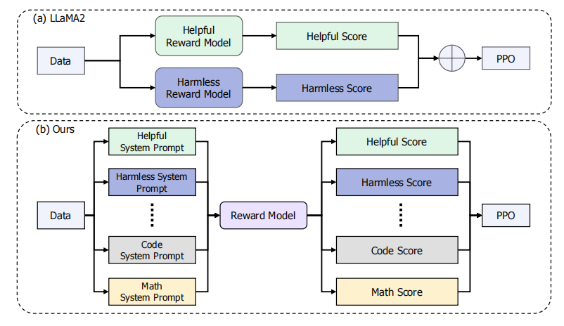

### 第一期 书生·浦语大模型全链路开源开放体系
课程笔记，学习InternLM2 Technical Report
### 1.摘要

   在4K上做初始化训练，32K上做进一步的预训练与微调，并且在200k的测试中也表现良好。
### 2.介绍
   开源1.8B, 7B, 20B  
   200k的上下文窗口  
   创新RLHF技术（Conditional Online RLHF）
### 3.预训练
   在预训练阶段，数据主要是中英文的书籍，网页，技术资料。其中英文的网页数据是主要的，其中英文网页数据67.51%，中文网页数据18.95%。      
   其中中文数据过滤了广告。    
   代码数据同样考虑到训练打分器，对代码做打分，其中代码质量中等的会给标注员标注后重新训练。  
   #### 数据管道  
   1. 长度选择，基于规则选择32k以上的
   2. 基于统计特征去除不合适的数据
   3. 困惑度选择，衡量文本的一致性，过滤掉干扰文本，

   使用AdamW优化器，我们使用余弦学习率的衰减和学习率的衰减到其最大值的10%。

   预训练分阶段：  
   在第一阶段，我们使用了长度不超过4k的预训练语料库。

   在第二阶段，我们纳入了50%的长度不超过32k的训练前语料库。

   在第三个阶段，我们使用了特定于能力的增强数据。在每个阶段，我们用英语、中文和代码混合数据。
### 4. 对齐
   #### SFT
   SFT中使用任务包括：NLP 任务，数学，代码，安全，对话，函数调用。

   其中主要是对话（50.37%），NLP任务（16.57%），数学（18.23%）。

   #### Conditional reward model

   传统的方法通常依赖于多个偏好模型来解决不同领域之间的偏好冲突
   
   从图片看，确实是一个从两个奖励模型变为一个奖励模型，但是多出了不少的系统提示，用不同的提示产生不同的偏好反馈效果。以前是一个偏好任务训练一个模型，现在是通过系统提示词改变模型，有点类似prefix learning。

   改变传统的Focal Loss, 添加衰减来防止模型对于容易样本的过拟合，

   看完，感觉工程量惊人。大模型强者，恐怖如斯。