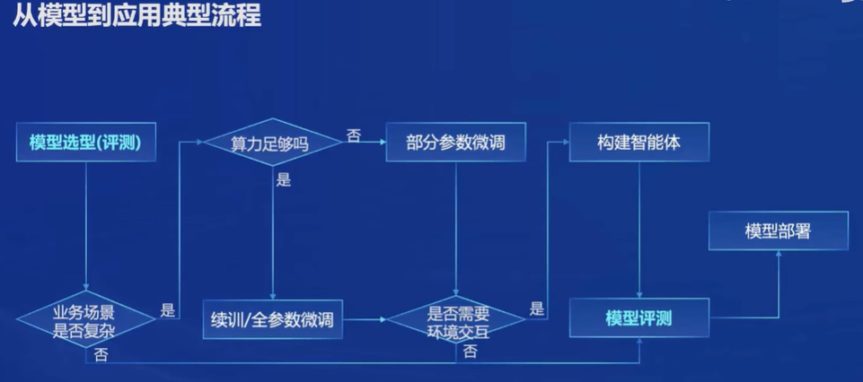

# 课程笔记
## 模型介绍

书生 浦语2.0（InterLM2）包含三个模型版本

7B：为了轻量级的研究和应用提供了一个轻量但性能不俗的模型
20B: 模型的综合性能更加强劲，可以有效支持更加复杂的食用场景

InterLM2-Chat 在base基础上，经过SFT和RLHF，面向对话进行优化，具有很好的指令遵循，共情聊天和调用工具等能力

InterLM2：在大部分应用中考虑选用的优秀基座。

# 模型能力：
AI助手能力  
人文对话  
文学创作   
工具调用  
内生计算（不需要借助外部计算器）  
代码解释器  
数据分析

## 大模型开发应用流程

## 全链路开源

数据 -> 预训练 -> 微调 ->  部署 -> 评测 -> 应用

### 数据  
开放高质量数据集，数据集获取：https://opendatalab.org.cn/

### 微调
#### 增量训练
使用场景：让基座模型学习到一些新知识，如某个垂类领域的知识
训练数据：文章，书籍，代码等

#### 有监督微调
使用场景：让模型学会理解各种指令进行对话，或者注入少量领域知识
训练数据：高字量对话，问答数据

微调框架：XTuner

### 模型评测
大模型评测 compassKit

1. 数据污染检查
2. 长文本能力评测
3. 中英双语主管评测
4. 支持LMDeploy、vLLM、LighLLM等推理后端

compassHub： 大模型评测社区

### 智能体框架：

Lagent

支持ReAct，ReWoo，AutoGPT 

AgentLego: 多模态智能体工具箱 
